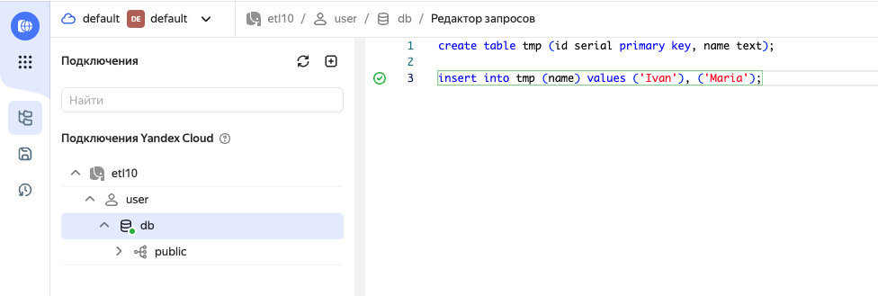
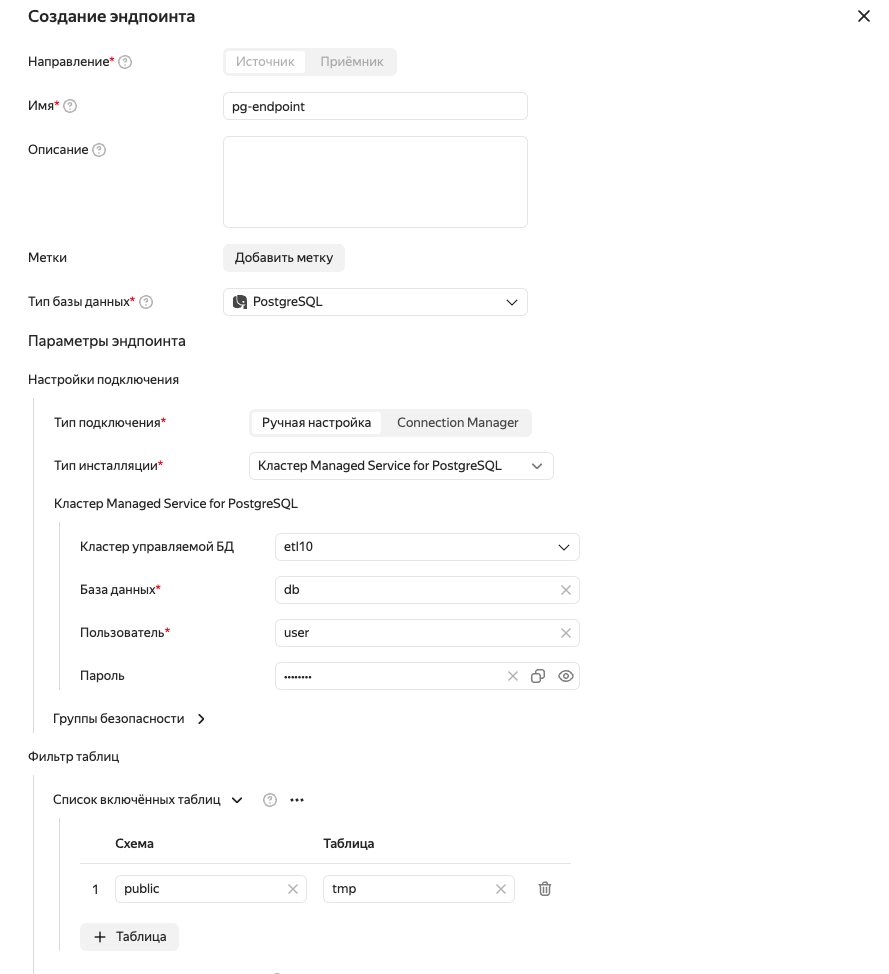
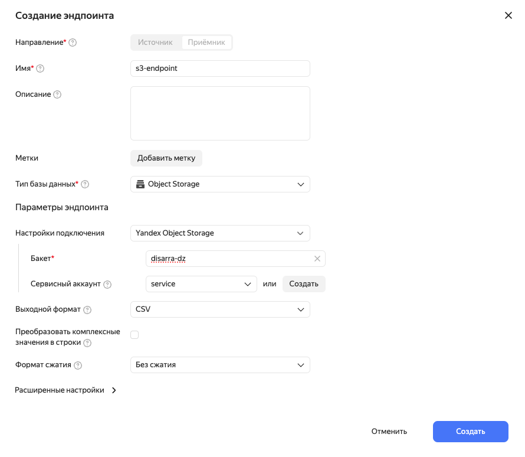
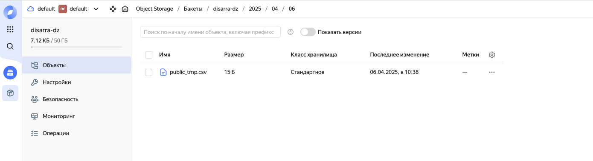

1. Создать кластер PG (бакет возьмем из предыдущей пратики)

2. Выполнить скрипт инициализации данных (скрипт init.sql в корне проекта)

3. Создать эндпоинт источник из ПГ 

4. Создать эндпоинт назначения в Object Storage

5. Создать трансфер

6. Скачать результат трансфера из Objecct Storage (положил csv тут в корень проекта)

